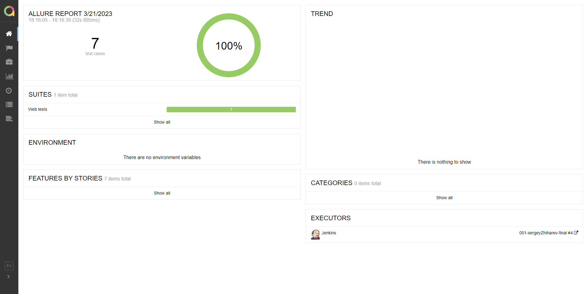
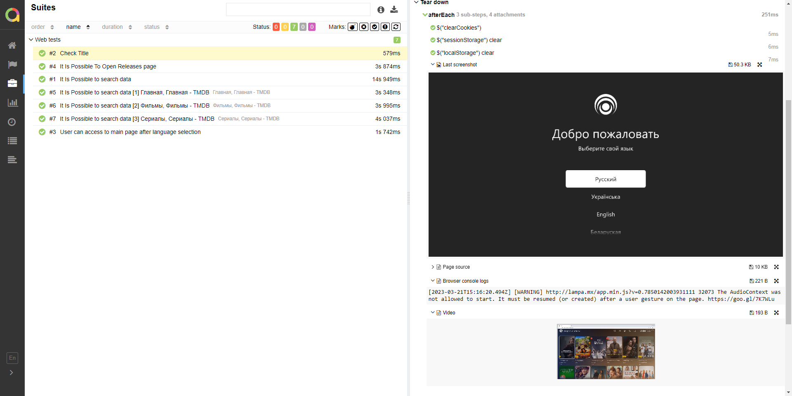
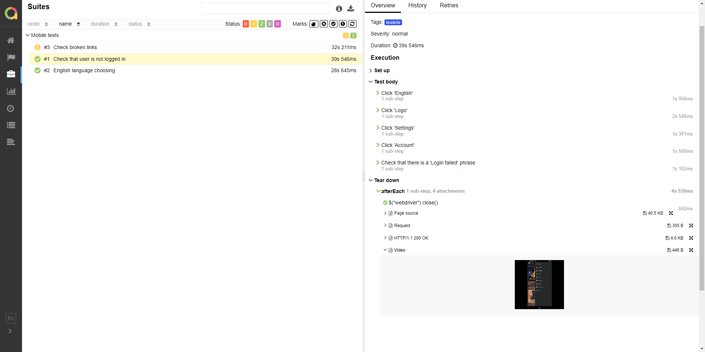
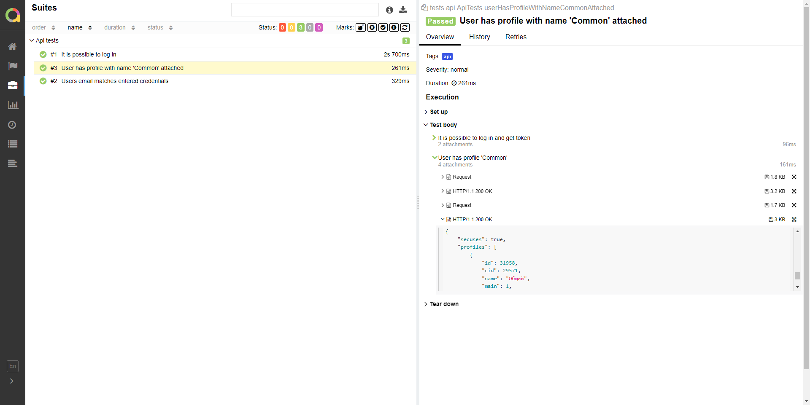
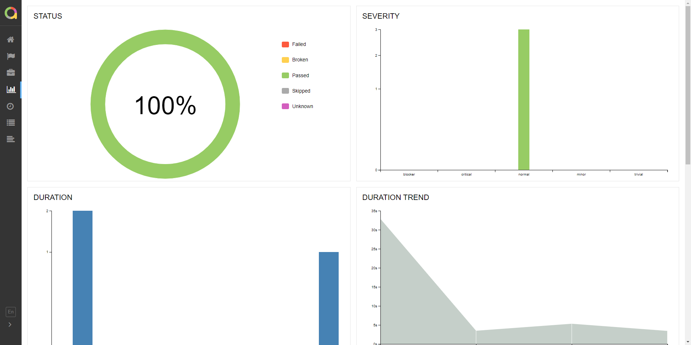
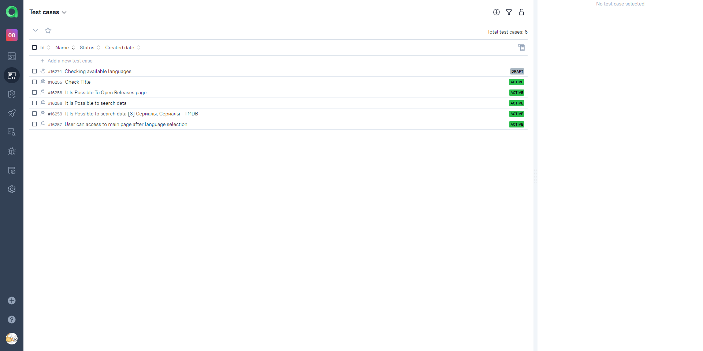
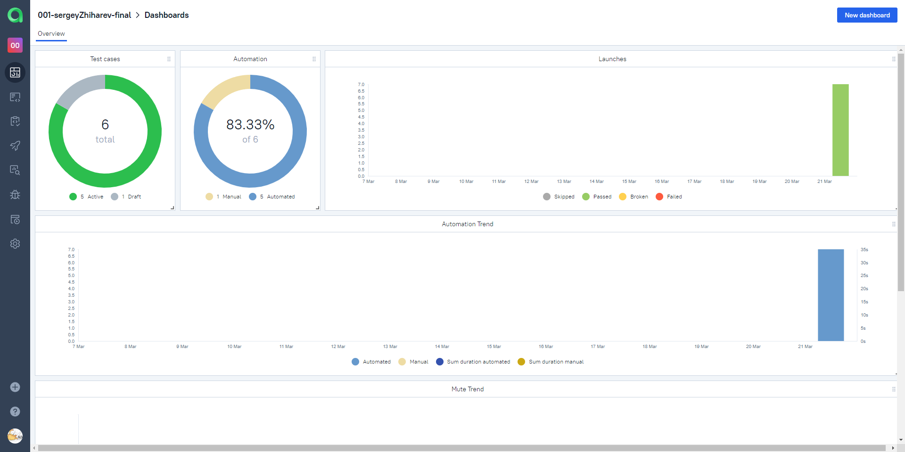
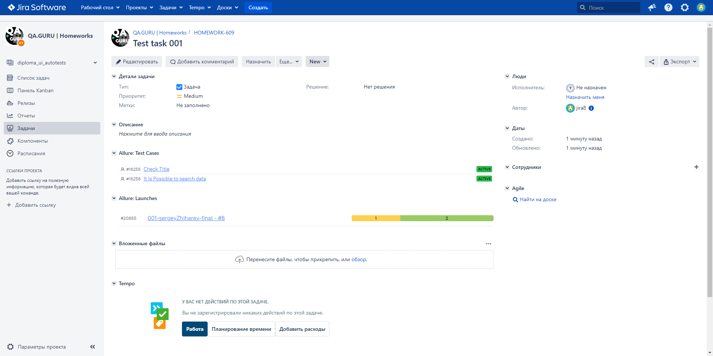
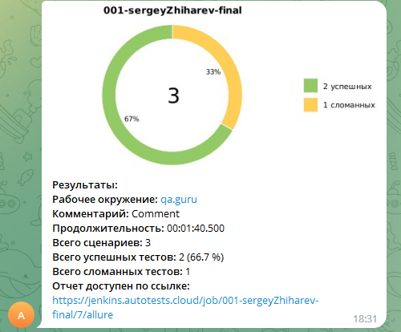
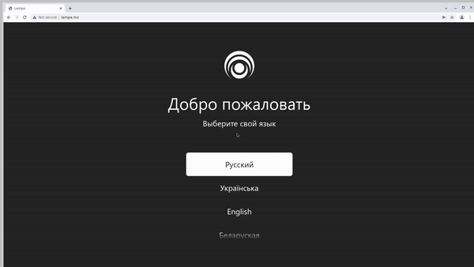

<h1> Автоматизации тестирования для онлайн-кинотеатра <a href="http://lampa.mx/">Lampa</a></h1>

<h3>Содержание:</h3>

<ul>
<li><a href="#tools">Технологии и инструменты</a></li>
<li><a href="#checks">Перечень проверок</a></li>
<li><a href="#launch">Запуск тестов</a></li>
<li><a href="#report">Allure-отчет</a></li>
<li><a href="#testops">Интеграция с Allure TestOps</a></li>
<li><a href="#jira">Интеграция с Jira</a></li>
<li><a href="#telegram">Интеграция с Telegram</a></li>
<li><a href="#video">Видео пример прохождения тестов</a></li>
</ul>

<h2 name="tools">:memo:Технологии и инструменты:memo:</h2>

<h2 name="checks">:memo:Перечень проверок:memo:</h2>
<h3>Web</h3>

- [x] User can access to main page after language selection
- [x] It Is Possible To Open Releases page
- [x] It Is Possible to search data
- [x] Checking titles for pages
- [x] Check Title

<h3>Mobile</h3>

- [x] English language choosing
- [x] Check broken links
- [x] Check that user is not logged in

<h3>Api</h3>

- [x] It is possible to log in
- [x] Users email matches entered credentials
- [x] User has profile with name 'Common' attached

<h3>Ручные тесты</h3>

- [x] Checking available languages

<h2 name="launch">:memo:Запуск тестов:memo:</h2>

<pre>
gradle clean ${env} -Denv=${env}
</pre>

Доступные значения переменной ${env}

<pre>
web_local - локальный запуск Web тестов с тегом "web"
web_remote - удаленный запуск Web тестов с тегом "web"
mobile_local - локальный запуск Mobile тестов с тегом "mobile"
mobile_bs - удаленный запуск Mobile тестов с тегом "mobile" в Browserstack
api - запуск Api тестов с тегом "api"
</pre>
<pre>
Параметры каждой переменной ${env} содержатся в соответствующем файле .properties, расположенном в ресурсах
</pre>

<h3>Проект в Jenkins:</h3>
<ol>
<li>Открыть <a target="_blank" href="https://jenkins.autotests.cloud/job/001-sergeyZhiharev-final/">проект</a> в Jenkins</li>
<li>Выбрать пункт "Собрать с параметрами"</li>
<li>В случае необходимости изменить параметр запуска, выбрав соответствующее значение из выпадающего списка</li>
<li>Нажать "Собрать"</li>
<li>Результат запуска сборки можно посмотреть в отчёте Allure</li>
</ol>

<h2 name="report">:memo:Allure-отчет:memo:</h2>

<h3>Главное окно</h3>

<h3>Тесты Web</h3>

<h3>Тесты Mobile</h3>

<h3>Тесты Api</h3>

<h3>Графики</h3>

<h2 name="testops">:memo:Интеграция с Allure TestOps:memo:</h2>
<h3>Список всех тест-кейсов</h3>

<h3>Dashboard</h3>

<h2 name="jira">:memo:Интеграция с Jira:memo:</h2>

<h2 name="telegram">:memo:Интеграция с Telegram:memo:</h2>

<h2 name="video">:memo:Видео пример прохождения тестов:memo:</h2>
<h3>Web</h3>

<h3>Mobile</h3>

